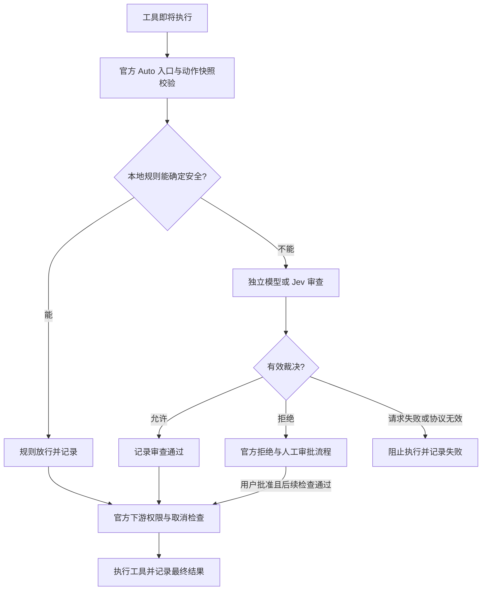

# 官方 Auto Review Plus：新版设计

日期：2026-10-07。状态：增强实现与本地验证已完成，待真实宿主验收与部署切换。

## 1. 产品目标

在官方 Auto Review 的基础上增强：**确定安全的动作直接放行，需要判断的动作由独立审查模型或 Jev 决策，并能看到每一步真实记录。**

基线是 `@deepseek-ai/dsh-experimental-auto-review@0.2.0-rc.2`。保留它已经接好的工具执行入口、权限档位、动作校验、拒绝审批和生命周期；不再以第三方插件替代整条链路。

## 2. 权限分类与处理

分类针对一次实际动作，结合可信工具身份、参数、目标范围与已知效果。同一工具可以命中不同分类。

| 分类 | 处理 | 示例及边界 |
|---|---|---|
| 能确定安全 | 本地规则直接放行，不请求模型 | 首批只纳入能证明无敏感暴露、无危险副作用的本机会话/状态查询；普通文件只读需完成目录边界、敏感路径与约束检查后才可纳入 |
| 需要判断 | 独立模型或 Jev 审查 | 普通文件改写、目标范围不完全明确的动作、权限约束需要解释的操作 |
| 危险动作 | 必须交给模型判断实际授权和影响；按官方规则处理 | 删除既有文件、覆盖重要文件、生产环境、外部写入、安全控制变更等，不能命中安全快通道 |
| 官方禁止的高风险 | 拒绝 | 敏感信息跨信任边界泄露等；模型返回放行也不能执行 |

“危险动作”是进入审查前的分流类别；官方最终风险协议仍使用 `low / medium / high`。不可逆删除、生产或外部写入在官方策略里通常属于需要明确授权的 `medium`，敏感信息泄露属于始终拒绝的 `high`，两者不要混为一类。

安全快通道的原则：

1. 用小范围、经过测试的规则，优先准确性；首版不追求所有工具都能跳过模型。
2. 校验实际执行动作与官方冻结快照一致；有缺失、歧义或冲突时无法通过规则。
3. 文件目标要校验实际解析后的范围，包含目录穿越、符号链接与敏感路径。
4. Shell/脚本、通用写入、删除、网络发送、生产操作、未知插件能力都进入模型审查，不能凭名称或“只读”描述放行。
5. 规则无法证明安全就进入模型；不把缓存命中、参数变化或工具描述当成已获权限。
6. 规则放行仍经过官方下游执行检查；下游拒绝、取消和人工审批决定优先。

对自由文本的用户限制无法确定是否兼容时，交给模型解释，避免快通道越过明确禁止事项。

## 3. 审查模型与 Jev

设置页提供三种业务选择：

- **跟随当前会话模型**：默认选项，保留官方体验。
- **独立审查模型**：从宿主现有服务和模型列表选，主对话模型保持独立。
- **Jev 直接决策**：选择 TypeSafe 官方、Command Code 或自定义 HTTPS 服务。

Jev 使用自己的结构化决策接口，不当聊天模型或子代理使用。输入基于官方已过滤并冻结的审查证据，继续区分真实用户指令、直接父级指令、约束与普通事实，不引入第三方完整会话转录作为新授权来源。

适配器统一输出官方的风险/裁决结构。保留严格的组合校验：只有 `low + allow`、`medium + allow/deny`、`high + deny` 合法。无效组合、低于配置置信度、超时、取消、鉴权或网络失败都阻止当前操作并记录具体原因。

普通模型沿用官方 `ctx.llm.stream` 调用方式，只调整审查使用的服务和模型；不另起聊天子代理。请求失败时不自动改用更贵的模型，也不自动重试收费请求。

密钥使用宿主凭据/秘密设置能力，只向界面返回“已配置”等状态。密钥绑定所选通道，切换通道不转发旧密钥。Command Code 的零留存支持限制在保存设置前明确展示，报错后不自行降低隐私保护。

### 决策输入：已确认方案

用户已确认采用“最近两轮为重点，补充更早仍有效的授权、限制和必要操作事实”。整体输入为当前动作、项目背景、用户指令与操作事实，排除主模型回复正文和 reasoning。证据不足的处理未另行指定，沿用官方：停止自动放行，按当前会话审批策略转人工确认；没有人工审批权限的 child 则阻止执行。

已核对的官方输入是固定规则、当前工作目录、项目约束、过滤后的当前可见历史、完整待审动作五部分。官方排除主模型回复正文、reasoning 和工具结果正文；历史工具调用作为事实保留，用户指令按真实来源区分授权与约束，不机械限制为两轮。会话压缩后的 checkpoint 只能恢复事实背景，不能代替已离开可见上下文的原始授权。

最近两轮指包含当前用户输入的最近两轮用户原文，作为主要任务背景。补充两轮之外仍有效的授权/限制和必要操作事实；若不能确定旧限制是否仍有效，保留原文而不是自行丢弃。直接父级委派也保留来源和范围，不能盖过用户限制。

| 材料 | 内容 | 权威与处理 |
|---|---|---|
| 固定审查规则 | 风险定义、放行条件、拒绝条件、输出协议 | 由审查器固定提供，与待审内容分开 |
| 当前实际动作 | 工具身份、完整参数、目标范围、读/写/删/发送等效果、当前权限环境 | 来自执行入口的冻结快照；检查后脱敏，不由主模型重写 |
| 用户授权 | 与当前动作有关的用户原话、动作、目标、范围、数量/时限等 | 保留来源引用；不接受主模型自称“用户已同意”作为授权 |
| 有效限制 | 当前任务和项目中的仍有效禁令、约束、批准条件 | 无关历史可减少，仍有效限制不能因时间较早而省略 |
| 相关操作事实 | 目标是否本次创建、相关的先前调用与结果状态、必要的修改差异 | 作为事实，不变成新的权限；网页、工具返回和摘要标明不可信来源 |

不发送密钥、主模型 reasoning、无关完整对话或原始工具输出大段文本。敏感参数用明确占位保留存在性；不能把包含秘密的参数原样发送给另一审查服务。完整命令、目标范围和关键授权不能为了省 token 被截断；重要证据放不下时停止当前判断并明确说明。

相关背景的选择遵循来源和任务范围，不让主模型自行删掉不利证据。涉及早先授权或禁止事项时，保留仍有效的原始约束；摘要或 checkpoint 只能当事实，不能独立证明权限。选取规则必须测试“早先禁令仍有效”“后来仅部分授权”“旧任务授权不覆盖新目标”等情况。

项目背景以任务目标和当前项目指令为主；额外的创建/修改结果由真实工具执行记录提炼为事实，保留调用关联，不把模型叙述当作执行证据。发生指令冲突时，展示相关原文和明确撤销/替换关系。证据缺失或放不下时暂停当前动作，按官方会话审批策略处理。

普通模型接收明确分区的材料；Jev 接收同一份证据的结构化表示。判断策略一致，数据格式由适配器负责。

例如，用户要求“清理本次生成的临时文件，原始资料保留”：审查材料同时展示这句授权、待删除的精确目标，以及该目标是否确为本次创建的记录。目标为原始资料或没有创建证据时，不能把“清理”推断为删除授权。

输出保持简短且可校验：裁决和风险；拒绝时附具体原因。官方普通模型的放行对象只有风险和裁决，不额外要求它输出长篇解释；界面显示真实来源与风险，不编造放行理由。证据不足应指出缺少哪项授权/范围，按官方会话审批策略处理。

## 4. 完整处理链

范围继续覆盖原生调用和每个已开始的 PTC 内层调用。外层 `run_code` transport 与 PTC 程序直接 Node 效果是官方现有覆盖边界，界面和说明应如实标识；不承诺整个脚本的所有行为都经过逐工具审查。

## 5. 可见记录与保留

后端提供统一的真实记录，设置页和会话面板读取同一来源。记录至少包含：时间、会话与调用关联、工具名、规则放行/模型审查来源、实际服务与模型、审查状态、风险、耗时、脱敏后的理由及最终执行状态。

面板区分：**规则放行、审查中、审查通过、等待人工确认、审查拒绝、审查失败、操作取消**。审查通过与工具执行成功分别显示，防止后续执行失败被统计成成功。

- 规则放行也留记录，并单独计数，避免没有模型请求时误以为功能失效。
- 回合结束只清当前回合状态，历史记录和会话累计保留。
- 记录保存在部署目录独立的私有数据区，跨完整重启保留；不写入宿主不支持的自定义 Session 事件。
- 记录不包含密钥、原始 prompt、reasoning、完整响应或完整工具参数；失败信息写入前也要脱敏。
- 查询分页，界面默认加载最近记录；不因列表只显示少量条目就删除历史。日志清理由用户主动操作。
- 记录写入与审查完成状态一致；必要审计无法保存时阻止执行并报告，不静默丢记录。

存储实现优先复用宿主服务。独立记录用于观察与审计，不给主模型注入额外权限，不污染可恢复的会话日志格式。

## 6. 界面设计

**唯一增强入口**：在宿主侧边栏注册一个“自动审查 Plus”页签，里面提供当前会话状态、模型选择、全局设置和真实审查记录。保留原有官方 Auto 权限选择器；不增加会话标题栏按钮、独立设置侧栏入口或 `/autoreview`、`/auto-review` 命令。

**侧边栏页签内部**分为设置与记录区域：

| 分组 | 用户可做的事 |
|---|---|
| 审查方式 | 跟随主模型、选择独立模型、选择 Jev |
| Jev 通道 | 配置通道、密钥状态、超时与置信度，查看数据留存说明 |
| 安全快通道 | 查看哪些动作已验证能直接放行；首版提供保守的预设规则 |
| 记录 | 查看规则命中、模型裁决和失败，按状态筛选，主动导出或清理 |

设置识别真实安装条目，使用宿主带版本校验和秘密保护的设置写入，不依赖写死的条目名。全局设置在重启后保留；会话单独选模型时明确显示“本会话覆盖”，可恢复默认。

下拉菜单优先采用宿主现有界面组件与主题变量。菜单宽度受控，长模型名可换行，窄窗口自动限界；支持键盘选择、Esc 和点外部关闭。浅色/深色切换后立即跟随，加载失败仅显示重试，不显示可保存的空配置。

## 7. 实现位置与官方同步

- `upstream/auto-review/`：不可改动的官方基线，含源码、测试与资源。
- `packages/auto-review-plus/`：从官方基线复制后的增强实现。按职责少量拆出规则、审查适配、记录与客户端，避免照搬第三方大框架。
- `UPSTREAM.json`：固定官方提交、版本和基线哈希，升级时可核对差异。
- 新 npm 包拟名 `dsh-experimental-auto-review-plus`，版本从 `0.10.0` 起；未经发布请求不发布 npm。

可借鉴第三方的权限分级、规则先行、独立模型与清晰统计构思；不继承其子代理审查链、Session 扩展事件或现有实现作为主框架。

## 8. 交付顺序与验收

1. **官方基线**：确认来源与当前宿主版本，保留上游许可证和原有测试。
2. **原行为复现**：在官方宿主工具管线验证普通模型的放行、拒绝、人工审批、PTC、取消与卸载，确认从官方包改起后行为一致。
3. **权限快通道**：验证确定安全的动作不调用模型；路径穿越、敏感路径、工具身份变化、参数变化与未知行为不能误放行。两条分支都有真实记录。
4. **独立模型与 Jev**：验证服务/模型选择、通道密钥隔离、裁决合法性和技术失败；真实收费验证按单次许可单独执行。
5. **记录与界面**：验证跨回合/重启保留，审查与执行状态一致，深浅主题、长选项和窄窗口均可用。
6. **部署切换**：准备可安装包和恢复副本，确认影响后再切换当前桌面插件，保证同时只有一个插件提供 Auto 审查。

验收不能只靠界面加载或测试数量。必须在实际宿主工具执行管线证明：审查/规则决定先于 body；拒绝和失败时 body 未执行；人工批准后按官方流程执行；真实后端记录能在面板读取。

公开 GitHub 仓库只同步新设计、官方基线及后续源码/测试；本机第三方历史实现、部署配置、备份、会话、密钥、缓存、依赖和构建产物保持排除。

## 9. 当前进度

- 已完成：官方来源确认、对齐 `0.2.0-rc.2` 的 12 文件快照、新设计、公开提交排除和校验脚本。
- 已完成：增强版执行代码、安全快通道、独立模型/Jev 适配、持久记录与侧边栏页签界面。
- 已完成：类型检查、46 项测试、真实构建、界面深浅主题与窄窗口验证、包加载核验。
- 待完成：部署切换。当前桌面**没有**任何自动审查生效（官方被停用，增强版未安装），需要在新版通过真机验收后再切换。

### 9.1 本轮验证结论（2026-10-06）

| 项目 | 结果 |
|---|---|
| 类型检查 | 通过，无错误 |
| 测试 | 46 项全部通过（`npx vitest run --pool=threads`） |
| 构建 | 通过，后端 1.21 MB / 客户端 205 KB |
| 界面 | 深浅主题可读、320×620 与 420×820 菜单不溢出、长模型名换行、Esc 可关闭、密钥不回显 |
| 包 | `out/dsh-experimental-auto-review-plus-0.10.0.tgz`，349216 字节，SHA256 `A6634C1A786659DC2A59D7EFB566FFCF244EFC15E404C221A15993819704BE6B` |
| 包加载 | 用宿主同款解析方式导入成功，`apply` / `Config` / `jevTransport` / `typertRemote` 齐全 |

`pnpm test` 在本机沙箱内会因禁止派生子进程报 `spawn EPERM`；改用 `--pool=threads` 可在沙箱内跑通。浏览器验证同样无法在沙箱内启动，改用 Playwright MCP 浏览器完成，结论记录在 `packages/auto-review-plus/out/ui/checks.json`。

**尚未执行**：真实宿主工具执行管线上的端到端验收（审查决定先于执行、拒绝时工具未执行、面板能读到真实记录）。这一步需要安装并重启后才能做，见第 8 节验收要求。

### 9.2 审查修复与交互验证（2026-10-07）

- 修复：审计更新失败时阻止工具执行；自由文本指令、限制与 checkpoint 不再靠关键词排除；普通模型和 Jev 统一对当前及历史参数脱敏，包含 Cookie 与带空格的秘密值。
- 修复：记录按实际执行入口区分未执行与工具错误；人工确认结束后不再停留在“等待人工确认”，仍保留模型拒绝与最终执行结果的区分。
- 修复：慢模型服务不丢弃其他已返回的模型；恢复默认与选择 Jev 不等待无关模型列表。
- 修复：保存失败提示不被记录刷新清掉；切换会话时隔离旧请求并重置分页；设置读取失败时撤掉旧表单；离开 Jev 时清空未保存密钥；填写超时和置信度时在保存前校验；明确显示本会话覆盖状态。
- 验证：59 项测试全部通过、类型检查通过、后端与客户端构建通过；打包后的后端及侧边栏入口均可加载，3 个远程方法契约齐全。
- 沙箱测试命令：在源码目录运行 `node scripts/tool.mjs vitest run --pool=threads --configLoader=native`，使用已有依赖，无需下载工具；Windows 链接依赖下的 React 模块身份已在测试配置中修正。
- 修复版包：`packages/auto-review-plus/out/review-20261007-r2/dsh-experimental-auto-review-plus-0.10.0.tgz`，352501 字节，SHA256 `42467F53943A7C6F2398913DE8FFE0A359709C3C80CAF362653C109165860725`。旧包保留。

本轮没有调用真实收费审查服务，没有安装或改变桌面插件的启用状态。上述本地验证不替代第 8 节的真实宿主端到端验收。
